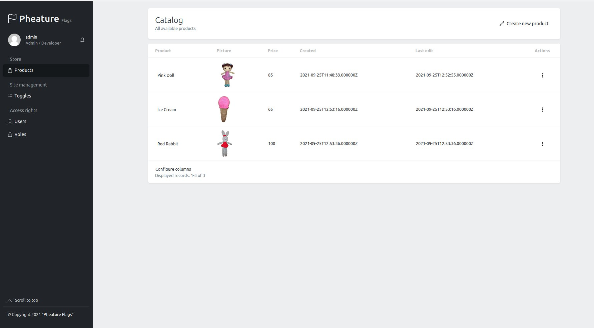
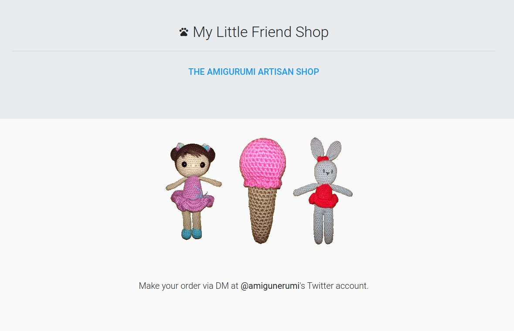

# Pheature Driven Laravel Example

Welcome to our Laravel Toggle example, In this app we will explain how to use [Pheature Flags](https://pheatureflags.io) library in an example ecommerce-like Laravel Web App.

In the following lines we will define the initial description of the ecommerce and also we will define a short of user-stories.

* *This is example app, every detail in the context, definition, and|or user-stories is fictional and created for learning purposes*

## Requirements

* PHP >= 8.0
* docker
* composer

## Install

```bash
git clone git@github.com:kpicaza/pheature-driven-laravel.git
cd pheature-driven-laravel
composer install
vendor/bin/sail up --build -d
vendor/bin/sail php artisan migrate
vendor/bin/sail php artisan pheature:dbal:init-toggle
vendor/bin/sail npm ci && npm run dev
vendor/bin/sail php artisan storage:link
```

Open browser in [http://127.0.0.1](http://127.0.0.1) you can see the website, or access to admin area
in [http://127.0.0.1/admin](http://127.0.0.1/admin)

## Context

We are going to build a small ecommerce website for a local [amigurumi](https://en.wikipedia.org/wiki/Amigurumi) artisan.

To reduce the time to market, we will iterate over the program updating and adding the required use cases:

1. First iteration:

We will build a landing page with a few requirements:

In that case we will use in-memory toggle implementation to use **release toggles**.

- [x] It should show the arstisan's logo.
- [x] It should show the artisans's commercial name.
- [x] It should show some amigurumi pictures.
- [x] It should show contact information.

2. Second iteration:

In order, to make our website looks like a real e-commerce, the first we need is to create some kind of **catalog**.

The catalog should show a list of available products. To be able to show products the thing we need are the products itself.
A **product** should have at least a *name*, *picture*, and *price*.

To create the products, we will need an authentication system for content editors, and an administration panel where manage the products.

- [x] It should have content editor users
- [x] It should have products
- [x] It should have a backoffice to add products
- [x] It should have a catalog that shows available products

3. Third iteration

## Screenshots





